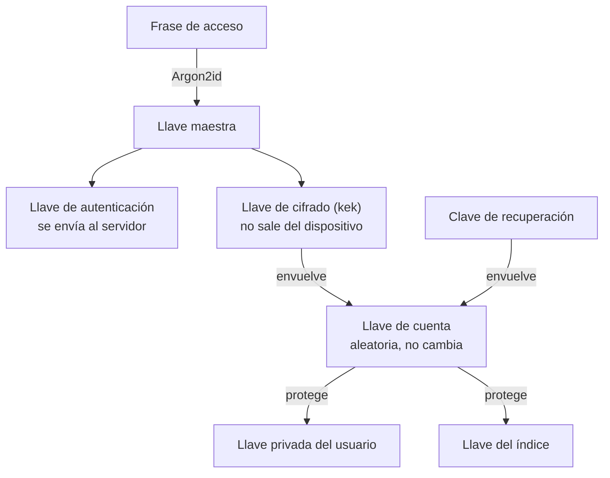

# ADR: Diseño criptográfico y gestión de llaves

## Introducción

- **Parte A: la decisión.** Contexto, alternativas evaluadas, decisiones, consecuencias y pendientes. 
- **Parte B: cómo funciona.** El mismo diseño explicado desde cero, con la lógica de cada llave y cada paso.

---

# Parte A: la decisión

## 1. Contexto y objetivo

Custodia guarda historias clínicas y su objetivo técnico es que ni el equipo que opera el servidor pueda leerlas. Los datos son de propiedad y gestión exclusiva del usuario: solo él decide quién los ve, por cuánto tiempo y si se los lleva.

La ley argentina trata los datos de salud como datos sensibles (Ley 25.326) y reconoce al paciente como titular de su historia clínica (Ley 26.529, art. 14). Por eso la garantía no puede ser una promesa del tipo "nosotros no miramos". Tiene que ser una propiedad técnica: el sistema se construye de modo que leer los datos sea imposible para el operador, y eso se puede verificar sobre el código y sobre lo que realmente se almacena.

Este documento registra cómo se logra esa propiedad: dónde se cifra, quién guarda las llaves, cómo se recupera el acceso y qué alternativas se evaluaron.

## 2. Protección en tránsito y en reposo

Ni el cifrado en tránsito ni el cifrado en reposo del servidor alcanzan por sí solos para cumplir el objetivo, porque en ambos casos el servidor termina viendo el dato o manejando las llaves.

En tránsito usamos TLS en toda comunicación entre el cliente y el servidor. Protege los datos mientras viajan por la red, frente a quien escuche la conexión o intente alterarla. Pero TLS termina en el servidor: al llegar, el servidor recibe el contenido en claro.

En reposo, los datos guardados en el servidor (base de datos y archivos) están cifrados. Protege frente al robo de un disco o de una copia de respaldo. Pero si es el servidor quien cifra y descifra, las llaves están a su alcance, y por lo tanto al alcance de quien lo opere o de quien logre comprometerlo.

| Capa | Protege contra | Límite |
| --- | --- | --- |
| TLS (en tránsito) | Quien escucha o altera la red | El servidor recibe el contenido en claro |
| Cifrado en el servidor (en reposo) | Robo de discos o de copias de respaldo | Quien opera o compromete el servidor, porque las llaves están a su alcance |
| Cifrado extremo a extremo (en el dispositivo) | El operador y quien comprometa el servidor, porque las llaves no están allí | El usuario pasa a ser el único que puede recuperar su acceso; el servidor sigue conociendo metadatos de tráfico |

Para que el operador no pueda leer nada hace falta cifrado extremo a extremo: los datos se cifran en el dispositivo del usuario antes de salir y las llaves nunca llegan al servidor. TLS y el cifrado en reposo se mantienen igual, como capas adicionales (defensa en profundidad).

## 3. Dónde se cifra

Decidimos cifrar en el dispositivo del usuario (origen) y no en el servidor (destino), para que la información viaje y se almacene siempre cifrada y el servidor nunca la vea.

| | Cifrar en el servidor | Cifrar en el dispositivo |
| --- | --- | --- |
| Cuándo se cifra | Al llegar al servidor, después de TLS | Antes de salir del dispositivo |
| Quién tiene las llaves | El servidor | El usuario |
| Qué ve el servidor | El contenido en claro, aunque sea un instante | Solo contenido opaco, identificadores, tamaños y fechas de sistema |
| Si roban el servidor | Acceden a los datos y a las llaves que el servidor usa | Se llevan cajas cerradas sin la llave |
| Búsqueda, filtros e IA | En el servidor, simple | En el dispositivo; la IA es una excepción declarada |
| Carga en el dispositivo | Baja | Alta: derivar llaves y cifrar en celulares de gama media |
| Si el usuario pierde el acceso | El operador puede ayudar | El operador no puede |

Esta decisión tiene cuatro consecuencias que el resto del diseño tiene que asumir:

- La búsqueda y los filtros se ejecutan en el dispositivo, sobre un índice que también está cifrado.
- La extracción de texto con IA es la única excepción: un servicio propio, efímero y sin persistencia ve un documento en claro solo cuando el usuario lo pide y lo consiente.
- El costo de cifrar en celulares de gama media es un riesgo real, y se mide en pruebas antes de fijar los parámetros.
- La recuperación del acceso pasa a ser un problema central de diseño, porque el operador no puede resolverla por el usuario.

## 4. Consecuencia central: el acceso depende del usuario

Si solo el paciente tiene las llaves, nosotros no podemos devolverle el acceso cuando las pierde, y ninguna ayuda del operador puede reemplazarlo. Es la contracara directa de la garantía de confidencialidad: a mayor garantía, mayor riesgo de pérdida.

Por eso el diseño tiene que incluir mecanismos para que el usuario no pierda el acceso, sin que esos mecanismos le den al operador la capacidad de leer. Cada mecanismo de recuperación es una puerta más hacia los datos, y se evalúa por lo que le da al usuario y por lo que le podría dar a un atacante o al operador.

## 5. Atributos de calidad

Lista de lo que le exigimos al diseño. Estos atributos entran en tensión: más seguridad suele significar menos comodidad y más riesgo de pérdida.

| Atributo | Qué exigimos en Custodia |
| --- | --- |
| Confidencialidad frente al operador | Ni el equipo ni quien robe el servidor puede leer el contenido ni los metadatos clínicos |
| Recuperabilidad | Quien olvida su frase o pierde su celular no pierde su historia, sin ayuda del operador |
| Redundancia y disponibilidad | Los datos cifrados se replican y respaldan sin riesgo, porque una copia sin la llave no revela nada; lo que no se puede replicar sin riesgo es la llave |
| Usabilidad | Desbloquear tarda pocos segundos (objetivo del backlog: menos de 5 segundos en un Android de gama media) y la frase es recordable |
| Rendimiento en el dispositivo | Cifrar archivos grandes, por ejemplo de 50 MB, sin bloquear la aplicación ni agotar la memoria |
| Multi-dispositivo | Entrar desde un dispositivo nuevo solo con las credenciales, sin copiar nada |
| Simplicidad y verificabilidad | Solo primitivas de una librería auditada, sin algoritmos propios, y un diseño que cada integrante pueda explicar y revisar |

## 6. Arquitecturas de manejo de llaves

Solo las opciones donde la llave queda fuera del alcance del operador cumplen el objetivo, y se diferencian sobre todo en cómo se recupera el acceso. El equipo eligió la opción 3.

| Opción | Si roban el servidor | Si el usuario pierde el acceso | Ventaja y costo |
| --- | --- | --- | --- |
| 1. Llaves en el servidor, junto a los datos | Se llevan datos y llaves: leen todo | El operador restablece el acceso | Simple, pero incumple el objetivo |
| 2. Llaves en un almacén separado del operador (KMS o HSM) | Necesitan además el almacén, pero el operador y quien lo comprometa siguen pudiendo leer | El operador restablece el acceso | Mejora frente al robo de discos, pero el operador puede leer |
| 3. Llave derivada de la frase del usuario, guardada cifrada en el servidor, con clave de recuperación (elegida) | Se llevan datos y llaves cifradas; solo la frase las abre | Se recupera con la clave de recuperación; sin ella ni la frase, se pierde | Cumple el objetivo y permite varios dispositivos; la seguridad depende de la fortaleza de la frase |
| 4. Llave aleatoria solo en el dispositivo, sin frase | No hay nada útil en el servidor | Perder el dispositivo es perder todo, salvo una copia manual | Muy fuerte, pero incómoda para cambiar de celular o usar varios |
| 5. Llave del usuario más copia de custodia en manos del operador | Depende de quién y cómo proteja la copia | El operador puede ayudar | Mejor recuperación, pero rompe que el operador no pueda leer |
| 6. Llave del usuario repartida en partes entre personas de confianza (reparto de secreto) | Nada útil, faltan partes | Se recupera juntando un número mínimo de partes | Recuperación sin operador, pero pide que el usuario tenga contactos dispuestos y es más complejo |

**Decisión: opción 3.** Derivamos la llave de la frase del usuario y la guardamos cifrada en el servidor, con una clave de recuperación como respaldo. Es la opción que mejor equilibra la confidencialidad, porque robar el servidor no permite leer nada, con una recuperación que no depende del operador y el uso desde varios dispositivos. Su costo es que la seguridad depende de la fortaleza de la frase y que perder la frase y la clave de recuperación a la vez es irreversible. Por eso la frase es de seis palabras generadas al azar y la aplicación lo advierte al crear la cuenta. La redundancia de los datos cifrados es sencilla con esta opción, porque una copia sin la llave no revela nada.

## 7. Decisiones tomadas

| Decisión | Motivo |
| --- | --- |
| Cifrado extremo a extremo en el dispositivo del usuario, con TLS en tránsito y cifrado en reposo en el servidor | Es la única combinación en la que el operador no puede leer, y las otras capas se mantienen como defensa en profundidad |
| Arquitectura de llaves: la llave sale de la frase del usuario y se guarda cifrada en el servidor, con clave de recuperación (opción 3) | Robar el servidor no permite leer nada, la recuperación no depende del operador y se puede usar desde varios dispositivos |
| Llave de cuenta aleatoria con dos envolturas, una por la frase y otra por la clave de recuperación | Cambiar la frase no rompe la recuperación y no obliga a tocar ningún documento |
| Frase de acceso de seis palabras generadas al azar por la aplicación | Unos 77 bits de aleatoriedad, que resisten la fuerza bruta aun con hardware especializado |
| Recuperación solo con la clave de recuperación de 256 bits, sin otras vías en el MVP | Cada vía extra de recuperación es una puerta más hacia los datos |
| Segundo factor TOTP (aplicación tipo Google Authenticator) al iniciar sesión en un dispositivo nuevo o con la sesión vencida, con códigos de respaldo obligatorios | Es un estándar abierto que no depende de un proveedor, y protege contra quien consiguió la frase |
| En un dispositivo donde ya hay sesión se desbloquea con la frase o, en la app Mobile, con la huella o el PIN del celular | Evita cansar al usuario sin bajar la seguridad, porque el sistema operativo limita los intentos |

Del segundo factor quedan fuera, por ahora, las passkeys y las llaves físicas (trabajo futuro) y el código por SMS o correo (más débiles y le dan más información al servidor). El TOTP no protege los datos si roban la base del servidor: en ese caso solo cuenta la fortaleza de la frase.

## 8. Llave de cuenta con dos envolturas

Adoptamos como diseño crear una llave de cuenta aleatoria, una sola vez, y guardarla protegida de dos formas independientes: una con la frase y otra con la clave de recuperación. Decisión confirmada por el equipo el 19/09/2026.

El problema que resuelve es este. En el diseño del anteproyecto, la clave de recuperación protege la llave de cifrado que sale de la frase. Si el usuario cambia su frase, esa llave cambia, y la copia protegida por la clave de recuperación queda con la llave vieja, que ya no abre nada. Actualizarla exigiría tener a mano la clave de recuperación, y en ese momento el usuario no la tiene. El resultado es que cambiar la frase rompe la recuperación, justo cuando más se la necesita.



Con este esquema, cambiar la frase rehace solo la envoltura de la frase. Olvidar la frase se resuelve abriendo la envoltura de la clave de recuperación y eligiendo una frase nueva. En ambos casos no se toca ningún documento. Cualquier método de recuperación futuro, como el reparto de secreto, sería una tercera envoltura de la misma llave.

### Alternativas para resolver la recuperación

| Opción | Cómo funciona | Pros | Contras |
| --- | --- | --- | --- |
| 1. Esquema del anteproyecto | La clave de recuperación protege la llave de cifrado que sale de la frase | Una llave menos, y ya está así en el backlog | Al cambiar la frase la recuperación deja de funcionar sin avisar, y el usuario cree estar protegido |
| 2. Esquema del anteproyecto, con clave de recuperación nueva en cada cambio de frase | Al cambiar la frase se genera y se muestra una clave de recuperación nueva, que invalida la anterior | Mismas piezas que hoy y corrige el problema | El usuario tiene que guardar una clave nueva cada vez; si no lo hace, queda sin recuperación; suma pantallas y pruebas |
| 3. Llave de cuenta con dos envolturas (elegida) | Una llave aleatoria fija protege las llaves del usuario y se guarda envuelta por la frase y por la clave de recuperación | Cambiar la frase no afecta la recuperación; la clave se guarda una sola vez; es un patrón habitual en gestores de contraseñas de conocimiento cero; permite sumar otras vías de recuperación | Una llave más para generar, explicar y probar; cambia cinco historias del backlog |

Otras formas de recuperación, como repartir la llave entre contactos de confianza, no compiten con estas: se sumarían como una envoltura más en la opción 3.

### Qué guarda el servidor por cuenta

Con la llave de cuenta, el servidor guarda estos datos por usuario, y solo puede leer los que no son secretos.

| Dato | Para qué sirve | ¿Lo puede leer el servidor? |
| --- | --- | --- |
| Correo, sal y parámetros de derivación | Identifican la cuenta y permiten derivar las llaves en cualquier dispositivo | Sí, no son secretos |
| Llave de autenticación, con un segundo hash | Verifica al usuario sin conocer su frase | Solo ve el hash |
| Clave pública del usuario | Permite que otros cifren información hacia él | Sí, es pública |
| Llave privada y llave del índice, envueltas por la llave de cuenta | Protegen los documentos y el índice | No, están cifradas |
| Llave de cuenta, en dos copias: una envuelta por la frase y otra por la clave de recuperación | Permiten entrar con la frase o recuperar el acceso | No, están cifradas |

## 9. Primitivas y librería

Toda la criptografía sale de una única biblioteca auditada, libsodium, con la versión fijada. No hay algoritmos propios.

| Uso | Primitiva | Nota |
| --- | --- | --- |
| Convertir la frase en llave maestra | Argon2id, 64 MiB de memoria y 3 pasadas; piso de 32 MiB y 2 pasadas | Lento a propósito; resiste la fuerza bruta con GPU |
| Separar subclaves | `crypto_kdf_derive_from_key` (basada en BLAKE2b) | Reemplaza a HKDF-SHA-256; ver sección 12 |
| Envolver llaves y cifrar el índice | XChaCha20-Poly1305 con etiqueta de contexto y nonce aleatorio de 24 bytes | Cifrado autenticado |
| Cifrar archivos | Flujo por bloques de XChaCha20-Poly1305 (`secretstream`), bloques de 1 MiB | Detecta alteración, reordenamiento, corte y agregados |
| Entregar la llave de un documento al usuario | Caja sellada sobre X25519 | Cualquiera cifra hacia el paciente, solo él abre |
| Huella de archivos | BLAKE2b | Verifica integridad |

**Alternativas consideradas.**

- **API criptográfica del navegador (WebCrypto).** El anteproyecto la descartó porque no ofrecía Argon2 ni X25519 de forma uniforme en los navegadores móviles, y porque su interfaz por promesas complica el cifrado por bloques. Ese soporte cambia con las versiones, así que la comparación tiene que reverificarse con los navegadores actuales antes de cerrar el ADR (pendiente en la sección 14). También queda por evaluar su uso solo para la caché local, por la aceleración por hardware.
- **Otras bibliotecas de JavaScript.** No se evaluaron en profundidad. libsodium se comporta igual en los tres canales (web, PWA y app Mobile) y es una biblioteca auditada.
- **Autenticación con OPAQUE.** Es más robusta, pero exige una biblioteca fuera de libsodium y es bastante más compleja. Se deja como mejora futura y se documenta el límite del método actual (sección 13).
- **Algoritmos o construcciones propias.** Descartadas.

## 10. Frase de acceso

La frase de acceso tiene seis palabras y las genera la aplicación al azar. Tomadas de una lista de 7776 palabras, seis palabras dan unos 77 bits de aleatoriedad, un nivel que resiste el intento de adivinarla por fuerza bruta aun con hardware especializado y con la derivación lenta de Argon2id.

Esa fortaleza solo se cumple si las palabras son realmente aleatorias. Si el usuario eligiera las suyas, la fortaleza real sería mucho menor, porque las personas eligen palabras predecibles. Por eso la aplicación ofrece pedir otra frase, pero no permite escribir una propia. Esto cambia los criterios de E1-HU-03, que hoy admiten frases elegidas por el usuario.

El costo es la comodidad: seis palabras son más largas de recordar y de escribir que una contraseña común. Se compensa con el desbloqueo por huella en la app Mobile y con la clave de recuperación para el caso de olvido. Al crear la cuenta, la aplicación advierte que sin la frase ni la clave de recuperación la bóveda se pierde.

## 11. Identificación y desbloqueo

Al usuario se le pide más o menos según la situación: frase y segundo factor en un dispositivo nuevo, y solo la frase o la huella en un dispositivo donde ya inició sesión.

| Situación | Qué se le pide |
| --- | --- |
| Primer inicio en un dispositivo, o sesión vencida o revocada | Frase de seis palabras y código del segundo factor (TOTP) |
| Desbloqueo en un dispositivo donde ya hay sesión, tras inactividad o al reabrir la aplicación | La frase; en la app Mobile, también la huella o el PIN del celular a través del almacén seguro del sistema |
| Olvidó la frase | Clave de recuperación y código del segundo factor, o uno de respaldo, para elegir una frase nueva |
| Perdió el celular del autenticador | Un código de respaldo |

Consideramos dispositivo seguro a uno donde el usuario ya inició sesión con frase y segundo factor y cuya sesión sigue vigente; no hay una lista de dispositivos de confianza aparte. No usamos un PIN propio de la aplicación, porque un PIN corto guardado en el dispositivo se puede adivinar sin límite si roban los datos. El PIN o la huella del propio celular sí sirven, porque el sistema operativo limita los intentos.

En el navegador no contamos con un almacén seguro equivalente para las llaves, así que en web y en la PWA se pide la frase. El desbloqueo por almacén seguro es la historia recortable E11-HU-12: si se recorta, la app Mobile también pide la frase. Cuántos días dura una sesión antes de volver a pedir el segundo factor se define al implementar las sesiones (E1-HU-16).

### Llaves en el dispositivo

Por defecto, las llaves descifradas viven solo en la memoria de la aplicación y se borran al bloquear, recargar o cerrar; lo único que se guarda de forma persistente en el dispositivo es contenido cifrado.

| Dónde | Qué queda ahí | Cuándo se borra |
| --- | --- | --- |
| Memoria de la aplicación | Las llaves ya derivadas, mientras la bóveda está desbloqueada | A los 10 minutos de inactividad (configurable), al cerrar sesión, al recargar la página o al cerrar la pestaña |
| Almacenamiento del dispositivo | Solo contenido cifrado: el índice y una caché de archivos con límite, para poder leer sin conexión | Al cerrar sesión; sin las llaves no revela nada |
| Almacén seguro del sistema (solo app Mobile) | La llave de cifrado, si el usuario activa la huella; la frase no se guarda en ninguna forma | Al desactivar la huella o cerrar sesión |

La consecuencia es que en web y en la PWA recargar la página obliga a escribir la frase de nuevo. Es más incómodo, pero evita dejar llaves en un lugar que cualquier script del navegador podría leer. Esta es la política por defecto y se confirma con el resto del equipo en la revisión.

## 12. Consecuencias y límites declarados

- Perder la frase y la clave de recuperación a la vez implica la pérdida irreversible de la bóveda. La aplicación lo advierte en el alta.
- El TOTP protege contra quien consiguió la frase, pero no protege los datos si roban la base del servidor. Ahí solo cuenta la fortaleza de la frase y el costo de Argon2id.
- La autenticación envía una llave derivada de la frase y el servidor la vuelve a hashear. Es el patrón habitual de los gestores de contraseñas de conocimiento cero, con el límite anterior. Un servidor malicioso podría entregar parámetros de derivación débiles al iniciar sesión, por eso el cliente rechaza todo valor por debajo del piso (32 MiB y 2 pasadas), y el servidor devuelve parámetros falsos pero estables para correos inexistentes, así no revela qué cuentas existen.
- En web y PWA, el operador podría servir un cliente alterado que capture la frase. Se mitiga con política de seguridad de contenido, integridad de recursos y compilación reproducible, y se elimina solo en la app Mobile, donde el código va firmado dentro del paquete.
- El servidor conoce metadatos de tráfico (quién compartió con quién y cuándo), aunque no el contenido.
- Durante la extracción de texto con IA, el servicio de extracción ve el documento en claro de forma efímera y a pedido explícito del usuario.
- La búsqueda y los filtros solo existen en el dispositivo.


---

# Parte B: cómo funciona, explicado desde cero

En el diseño se mezclan varias ideas distintas: frase, salt, Argon2, llave maestra, subclaves, autenticación y cifrado. Esta parte las ordena de a una. Los nombres importan menos que la lógica: si se entiende para qué existe cada llave, los nombres se acomodan solos.

## B.1 El mapa en una página

```
NIVEL 1: lo que recuerda la persona

        frase de 6 palabras  +  salt (público)
                    |
                    v
NIVEL 2: convertir la frase en un secreto fuerte

                 Argon2id
                    |
                    v
          LLAVE MAESTRA (32 bytes)
                    |
                    v
NIVEL 3: una llave para cada responsabilidad

                   KDF
              /           \
             v             v
         authKey           kek
      "demuestra         "abre la llave de cuenta"
       quién soy"        (queda en el dispositivo)
    (va al servidor)          |
                              v
NIVEL 4: la llave de cuenta (aleatoria, no cambia nunca)

                          UK
                    /            \
                   v              v
           llave privada     llave del índice
                   |
                   v
NIVEL 5: los documentos

     cada documento tiene su propia llave (DEK),
     cerrada hacia la llave pública del usuario
```

Aparte de este camino, hay una segunda forma de abrir la llave de cuenta: la clave de recuperación. Se ve en detalle más abajo.

La idea completa cabe en tres frases. La frase del usuario genera un secreto principal. De ese secreto salen llaves distintas para tareas distintas. El servidor recibe solamente lo necesario para reconocer al usuario y guarda datos cifrados; la capacidad de descifrar queda del lado del usuario.

## B.2 Punto de partida: la frase

Supongamos que la aplicación le genera a una usuaria esta frase:

```
abaco cielo dado fuego llave puente
```

Todavía no es una clave criptográfica. Una clave de cifrado adecuada son 32 bytes aleatorios, algo como `8F 23 A1 91 7C 04 88 ...`, imposible de recordar para una persona. Y una frase tiene otra forma: largo variable, letras, espacios.

El problema es entonces: ¿cómo se hace para que una persona recuerde algo cómodo, como seis palabras, y que el sistema termine teniendo una clave de 32 bytes? Ahí aparece Argon2id. Pero antes hace falta un ingrediente más: el salt.

## B.3 El salt

Un salt es un valor aleatorio que se le entrega a la derivación como una entrada más. No se suma ni se concatena con la frase: Argon2id recibe las dos cosas por separado.

```
Argon2id( frase , salt , parámetros )  ->  llave maestra
```

¿Para qué sirve? Imaginemos que Alberto y Juan tienen exactamente la misma frase. Sin salt, los dos obtendrían la misma llave. Con salts aleatorios distintos:

```
Alberto:  frase + salt A781...  ->  Argon2id  ->  llave 91BC...
Juan:     frase + salt 71CC...  ->  Argon2id  ->  llave FF82...
```

La misma frase da llaves completamente distintas. Hay un segundo beneficio: si alguien roba la base de datos e intenta adivinar frases, tiene que repetir el trabajo para cada usuario por separado, porque ningún cálculo sirve para otro.

**El salt no es secreto.** El servidor lo guarda junto con la cuenta y los parámetros de Argon2id. Un atacante puede conocerlo sin que eso rompa nada, porque lo que no conoce es la frase. Su función es hacer única cada derivación, no funcionar como contraseña.

En Custodia se genera un salt nuevo de 16 bytes al crear la cuenta y cada vez que se cambia la frase.

## B.4 Argon2id y la llave maestra

Argon2id es una función que convierte la frase y el salt en una llave de 32 bytes, y tiene dos propiedades que interesan.

**Es lenta a propósito.** Necesita mucha memoria (64 MiB) y varias pasadas (3). Para el usuario legítimo es un costo de unos segundos al desbloquear. Para un atacante que quiere probar millones de frases es un costo enorme por cada intento, y la memoria que exige le dificulta aprovechar hardware especializado.

**Es determinística.** La misma frase, con el mismo salt y los mismos parámetros, produce siempre la misma llave maestra. Esto es lo que permite volver mañana, o entrar desde otro celular, y reconstruir las mismas llaves sin haber guardado nada. Y si se escribe una frase distinta aunque sea en una letra, sale una llave maestra completamente distinta.

Los parámetros (memoria y pasadas) se guardan con la cuenta, así que un dispositivo nuevo usa los mismos que se usaron al crearla. Hay un piso (32 MiB y 2 pasadas) por debajo del cual el cliente se niega a derivar, para que un servidor malicioso no pueda pedir parámetros débiles.

La llave maestra es el secreto más poderoso del esquema, y por eso **no se usa directamente, no se guarda y no se envía**: se calcula, se derivan las subclaves y se descarta.

## B.5 Una llave, un propósito

La llave maestra tiene que cumplir dos funciones distintas: identificar al usuario ante el servidor y proteger la información. Podría usarse la misma para las dos, pero en criptografía se evita usar un secreto para dos propósitos. Es el principio de separación de llaves: una llave, un propósito.

Entonces se aplica una KDF (función de derivación de claves), que toma una llave y produce otras:

```
                 LLAVE MAESTRA
                       |
                      KDF
                 /           \
                v             v
   KDF(maestra, "custauth")   KDF(maestra, "custkek!")
                |                       |
             authKey                   kek
```

Las dos salen de la misma llave maestra, pero son distintas, y mirando una no se puede deducir ni la otra ni la maestra. La KDF va en un solo sentido.

En el código esto es `crypto_kdf_derive_from_key` de libsodium, con etiquetas de 8 caracteres que identifican cada propósito. El anteproyecto pensaba usar HKDF sobre SHA-256, pero esa función no está disponible en la versión de libsodium para JavaScript que se probó (ver sección 12).

## B.6 authKey: cómo el servidor reconoce al usuario sin conocer su frase

La `authKey` sirve para decirle al servidor: "soy quien conoce la frase correcta". El servidor nunca recibe la frase, ni la llave maestra, ni la `kek`. Solamente recibe la `authKey`, y además la vuelve a hashear antes de guardarla.

```
DISPOSITIVO                                    SERVIDOR

frase + salt
    |
 Argon2id
    |
llave maestra
    |
   KDF
    |
 authKey  ------------------------------->  hashea otra vez y compara
 + código TOTP                               con lo que tiene guardado
```

Dos consecuencias importantes:

- **Conocer la `authKey` no da la `kek`.** El servidor puede autenticar al usuario sin poder descifrar nada. Esa es la separación central del esquema.
- **El segundo hash protege una filtración.** Si roban la base de datos, no se llevan una credencial lista para usar en el inicio de sesión, y además necesitarían el código TOTP.

Para iniciar sesión, el dispositivo primero le pide al servidor el salt y los parámetros de esa cuenta. Si el correo no existe, el servidor devuelve un salt y parámetros falsos pero siempre iguales para ese correo, así nadie puede averiguar qué cuentas existen.

## B.7 La kek y la llave de cuenta

La `kek` (key encryption key, también llamada llave envolvente o key wrapping key) no cifra documentos. Se usa para cifrar otras llaves. A eso se le llama **envolver** una llave: protegerla dentro de una caja cifrada con otra llave. Cada caja lleva además una etiqueta de contexto que la ata a su lugar, de modo que si el servidor intercambia dos cajas, la caja movida no abre.

Acá está la decisión de diseño más importante de esta parte. Un esquema simple sería que la `kek` envuelva directamente las llaves importantes, y que la clave de recuperación envuelva la `kek`. Tiene un defecto grave: la `kek` sale de la frase. Cuando el usuario cambia su frase, la `kek` cambia, y la copia protegida por la clave de recuperación queda con la `kek` vieja, que ya no abre nada. La recuperación se rompe sin avisar.

La solución es agregar una capa: la **llave de cuenta (UK)**. Es una llave aleatoria, creada una sola vez al crear la cuenta, que no depende de la frase y nunca cambia. Se guarda en el servidor dentro de **dos cajas**:

```
                 llave de cuenta (UK)
                  /               \
                 v                 v
     caja 1: cerrada          caja 2: cerrada
     con la kek               con la clave de recuperación
     (sale de la frase)       (la guarda el usuario)
```

Cualquiera de las dos cajas abre la UK. Y la UK es la que protege todo lo demás. Con esto:

- Al **cambiar la frase**, solo se rehace la caja 1. La caja 2 sigue valiendo porque la UK no cambió.
- Al **olvidar la frase**, se abre la caja 2 con la clave de recuperación y se elige una frase nueva, que genera una caja 1 nueva.
- Un **método de recuperación futuro** sería simplemente una caja 3.

## B.8 La llave privada, la pública y los documentos

La UK protege dos cosas: la llave privada del usuario y la llave del índice.

**El par de llaves.** Cada usuario tiene un par de llaves (X25519): una pública y una privada. La pública puede conocerla cualquiera, incluso el servidor. La privada solo existe en claro dentro del dispositivo, y en el servidor está guardada dentro de una caja cerrada con la UK.

La analogía es un buzón. Cualquiera puede dejar una carta en el buzón (cifrar hacia la llave pública), pero solo el dueño tiene la llave para abrirlo (la privada). A esto se le llama **caja sellada**. Es la base para que más adelante un profesional pueda subir un estudio hacia el paciente sin poder leer nada de lo que el paciente ya tiene.

**La llave del índice.** Los metadatos clínicos (fechas, especialidades, etiquetas, títulos) viven en un índice que se guarda cifrado con esta llave. El servidor solo ve un bloque opaco.

**Una llave por documento.** Cada documento se cifra con su propia llave aleatoria (DEK). Esa llave se cierra en una caja sellada hacia la llave pública del usuario:

```
                    llave pública del usuario
                              |
   radiografia.pdf  --cifrado con-->  DEK A  --caja sellada-->  (guardada)
   analisis.pdf     --cifrado con-->  DEK B  --caja sellada-->  (guardada)
   foto.jpg         --cifrado con-->  DEK C  --caja sellada-->  (guardada)
```

Tener una llave distinta por documento permite compartir un documento sin exponer los demás: basta con entregar la llave de ese documento. Y para cambiar quién tiene acceso no hace falta volver a cifrar archivos enormes; se trabaja con la llave chica.

**Cómo se lee un documento:** la frase abre la caja 1, que entrega la UK. La UK abre la llave privada. La llave privada abre la caja sellada del documento, que entrega la DEK. La DEK descifra el archivo.

## B.9 Cómo se cifra un archivo grande

Un archivo de 50 MB no se carga entero en memoria. Se corta en bloques de 1 MiB y se cifra bloque por bloque con un flujo cifrado (XChaCha20-Poly1305 en modo `secretstream`). Cada bloque queda autenticado y, además, encadenado con los anteriores. Eso permite detectar:

| Alteración | Qué pasa al descifrar |
| --- | --- |
| Se cambia un byte de un bloque | Falla y se informa corrupción, sin mostrar contenido parcial |
| Se intercambian dos bloques de lugar | Falla |
| Se corta el archivo antes del final | Falla: el último bloque lleva una marca de final y sin ella se considera truncado |
| Se agregan bloques después del final | Falla |
| Se intenta abrir con otro identificador de archivo o con otra llave | Falla |

En el dispositivo hay un solo bloque en memoria a la vez. Los bloques cifrados viajan directo al almacenamiento de objetos con una URL prefirmada, sin pasar por la API.

## B.10 Qué guarda el servidor y qué no

| Dato | ¿Lo tiene el servidor? |
| --- | --- |
| Correo, salt y parámetros de Argon2id | Sí |
| Hash de la `authKey` | Sí |
| Clave pública del usuario | Sí |
| Llave privada, llave del índice y UK, siempre dentro de cajas cerradas | Sí, pero no puede abrirlas |
| Documentos, entradas e índice cifrados | Sí, como bloques opacos con su identificador, tamaño y fecha de sistema |
| La frase | No |
| La llave maestra | No |
| La `kek` | No |
| La clave de recuperación | No |
| Cualquier llave o documento en claro | No |

Esto es lo que hace interesante una arquitectura de cifrado en el cliente: el servidor conserva todo lo necesario para autenticar, autorizar y almacenar, pero no tiene forma de leer.

## B.11 Recorridos

### Crear la cuenta

1. La aplicación genera la frase de seis palabras y la muestra.
2. Se genera un salt aleatorio y, con la frase, Argon2id produce la llave maestra.
3. La KDF deriva la `authKey` y la `kek`.
4. Se generan al azar la UK, la llave del índice, la clave de recuperación de 256 bits y el par de llaves.
5. Se arman las cajas: la llave privada y la del índice cerradas con la UK, y la UK cerrada dos veces (con la `kek` y con la clave de recuperación).
6. Al servidor se envían el correo, el salt, los parámetros, la `authKey`, la clave pública y las cajas. Nada más.
7. Se muestra la clave de recuperación una sola vez y se exige confirmar que se guardó. Se configura el segundo factor y se entregan los códigos de respaldo.

### Volver mañana, o entrar desde otro celular

1. El dispositivo pide al servidor el salt y los parámetros de la cuenta.
2. La persona escribe la frase. Como Argon2id es determinística, se reconstruyen la misma llave maestra, la `authKey` y la `kek`.
3. Se envían la `authKey` y el código del segundo factor. El servidor los verifica.
4. El servidor entrega las cajas. La `kek` abre la caja 1, sale la UK, y de ahí la llave privada y la del índice.

No hubo que copiar nada de un celular al otro: todo lo necesario estaba en el servidor, cerrado.

### Escribir mal la frase

Una frase distinta produce una llave maestra completamente distinta, y con ella una `authKey` y una `kek` distintas. Fallan dos cosas de forma independiente: el servidor rechaza la `authKey`, y aun si no la verificara, la `kek` equivocada no puede abrir la caja 1. El descifrado falla por autenticación criptográfica, no por una comparación que se pueda saltear.

### Cambiar la frase

1. Con la bóveda abierta, la aplicación genera la frase nueva y un salt nuevo.
2. Se deriva una `authKey` y una `kek` nuevas.
3. Se rehace **solo la caja 1**, con la UK cerrada con la `kek` nueva.
4. El servidor actualiza el salt, el hash de la `authKey` y la caja 1. La llave privada, la del índice, la caja 2 y todos los documentos quedan intactos.
5. Se invalidan las sesiones en los otros dispositivos.

### Olvidé la frase

1. La persona ingresa su correo, la clave de recuperación y un código del segundo factor.
2. La clave de recuperación abre la caja 2 y entrega la UK.
3. Se genera una frase nueva y se procede como en el cambio de frase: caja 1 nueva, todo lo demás igual.
4. Todos los documentos y accesos anteriores siguen disponibles.

### Perdí la frase y la clave de recuperación

No hay forma de recuperar la bóveda. Las dos cajas que abren la UK quedan sin llave, y el servidor no tiene ninguna otra. La aplicación lo indica sin ofrecer alternativas engañosas, y lo advierte al crear la cuenta.

### Roban el servidor

El atacante se lleva la base de datos y los archivos. Tiene bloques cifrados, salts, parámetros, hashes y cajas cerradas. Para abrir algo necesita la frase de algún usuario, y su única vía es probar frases una por una fuera de línea, pagando en cada intento una derivación de Argon2id con 64 MiB y 3 pasadas, y repitiendo todo para cada usuario porque cada uno tiene su salt. Con seis palabras al azar de una lista de 7776, hay unos 2^77 candidatos por usuario, una búsqueda que se considera inviable. El segundo factor no interviene en este escenario, porque el atacante no necesita iniciar sesión.

Por eso la fortaleza de la frase importa tanto, y por eso la frase se genera al azar en lugar de dejar que el usuario la elija.

## B.12 Todas las llaves juntas

| Llave | De dónde sale | Qué protege | Dónde vive |
| --- | --- | --- | --- |
| Frase (6 palabras) | La genera la aplicación | Es el origen de la llave maestra | En la memoria del usuario, o en el gestor de contraseñas que elija |
| Salt | Aleatorio, de 16 bytes; nuevo al crear la cuenta y al cambiar la frase | Hace única cada derivación | Servidor (no es secreto) |
| Llave maestra | `Argon2id(frase, salt, parámetros)` | Es el origen de `authKey` y `kek` | En ningún lado: se calcula, se derivan las subclaves y se descarta |
| `authKey` | Subclave con etiqueta `custauth` | Identificar al usuario | Se envía en el inicio de sesión; el servidor guarda solo un hash |
| `kek` | Subclave con etiqueta `custkek!` | Abrir la caja 1 de la UK | Solo en la memoria del dispositivo |
| Llave de cuenta (UK) | Aleatoria, al crear la cuenta; no cambia | Protege la llave privada y la del índice | Servidor, en dos cajas (con la `kek` y con la clave de recuperación); en claro solo en la memoria |
| Clave de recuperación | Aleatoria de 256 bits, al crear la cuenta | Abre la caja 2 de la UK | El usuario; el servidor no la conoce |
| Llave privada y pública | Par X25519, al crear la cuenta | La pública permite cifrar hacia el usuario; la privada abre las cajas selladas | Pública en el servidor; privada cerrada con la UK |
| Llave del índice | Aleatoria, al crear la cuenta | Cifra el índice de metadatos | Servidor, cerrada con la UK |
| Llave de documento (DEK) | Aleatoria, una por documento | Cifra ese documento | Servidor, cerrada hacia la llave pública del usuario |

---

## Glosario

**Argon2id.** Función que convierte una frase en una llave de forma deliberadamente lenta y que exige mucha memoria, para encarecer los intentos de adivinar.

**authKey.** Subclave que se envía al servidor para demostrar que se conoce la frase. No permite descifrar nada.

**Caja sellada.** Cifrado hacia una clave pública: cualquiera puede cerrar la caja, solo el dueño de la clave privada la abre.

**Clave de recuperación.** Valor aleatorio de 256 bits entregado una sola vez al crear la cuenta. Abre la segunda caja de la llave de cuenta si se olvida la frase.

**Cifrado autenticado.** Cifrado que además detecta cualquier alteración del contenido. Si algo cambió, el descifrado falla en lugar de entregar datos incorrectos.

**DEK.** Llave de un documento. Aleatoria, una por documento, cerrada hacia la clave pública del usuario.

**Envolver una llave.** Protegerla dentro de una caja cifrada con otra llave.

**kek.** Subclave que abre la llave de cuenta. También se la llama llave envolvente. Nunca sale del dispositivo.

**KDF.** Función de derivación de claves: a partir de una llave produce otras, distintas e independientes, y solo en un sentido.

**Llave de cuenta (UK).** Llave aleatoria creada una vez, que no depende de la frase. Protege la llave privada y la del índice, y se guarda en dos cajas: una con la `kek` y otra con la clave de recuperación.

**Llave maestra.** Resultado de Argon2id. Se usa solo para derivar la `authKey` y la `kek`, y se descarta.

**Salt.** Valor aleatorio y público que hace única cada derivación, de modo que la misma frase dé llaves distintas en cuentas distintas.

**TOTP.** Código de 6 dígitos que cambia cada 30 segundos y se genera en una aplicación autenticadora. Es el segundo factor.